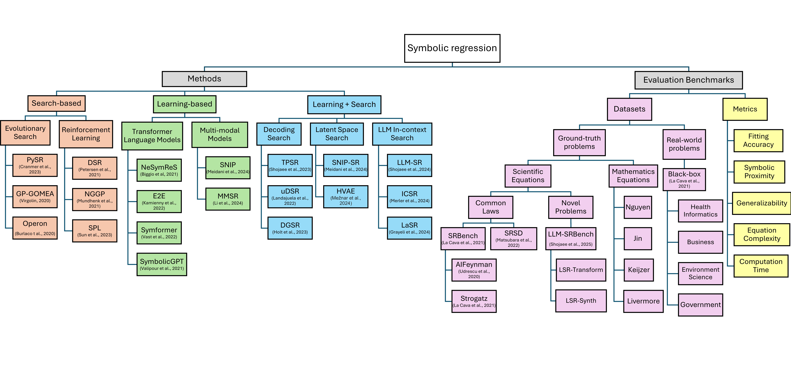

<h1 style="font-size: 60px; text-align: center;">Frontiers of LLMs for Automated Scientific Discovery: A Tutorial</h1>

  
    <a target="_blank" href="https://drive.google.com/file/d/1oTRnVPSqrHoJb5xcu3cQ0_Jtflpj4bqW/view?usp=sharing">[Slides]</a>
  

<meta name="thumbnail" content="./img/aaai-logo.png" />

<!-- Speakers -->

  

    
      
      

        

          
          <a class="speaker-name" href="{{ person.url }}" target="_blank" rel="noopener">{{ person.name }}</a>
          <small class="speaker-affil">{{ person.affiliation }}</small>
        

      

    
  

<!-- # Program Committee

  <ul class="list-group list-group-flush">
    
      <li class="list-group-item col-xs-6 col-sm-4 col-md-3">{{ p }}</li>
    
  </ul>

 -->

<!--# Taxonomy

-->

# About this Tutorial

This tutorial presents a structured overview of how artificial intelligence can accelerate the **cycle of scientific discovery**, divided into two phases: the **pre-experiment phase**, where hypotheses are systematically searched and optimized, and the **experiment-guided phase**, where hypotheses are improved and prioritized by leveraging feedback from experiments. Together, these phases illustrate how AI can drive a **complete discovery cycle**, moving from hypothesis formulation to experimental impact.  

In the **pre-experiment phase**, the central question is: *How are scientific hypotheses fundamentally formulated?* Directly generating valid hypotheses from background knowledge is intractable. A key advance was to introduce a **foundational equation** that decomposes this challenge into tractable subtasks: retrieving inspirations, composing hypotheses, and ranking them. This provides a principled basis for **exploratory discovery**. Yet most generated hypotheses remain **coarse-grained**, too vague to guide experiments. To address this gap, researchers have introduced the task of **fine-grained hypothesis discovery**, which requires producing hypotheses with detailed methodological and experimental specifications. This task has been shown to have **combinatorial optimization complexity**, as it involves selecting coherent details from a vast space of possibilities. A hierarchical optimization strategy mitigates this complexity by progressively refining hypotheses across levels of abstraction, effectively **smoothing the hypothesis search landscape** and enabling more reliable convergence toward testable outcomes.  

In the **experiment-guided phase**, the key challenge is how to leverage experimental feedback as a guiding signal. In domains where experimentation is relatively **efficient**, **symbolic regression (SR)** provides a powerful framework. SR seeks to uncover explicit mathematical equations directly from data, producing models that are both predictive and **interpretable**. Unlike black-box predictors, SR reveals transparent structures that enhance scientific understanding and trust. The tutorial will trace SR’s **foundations and evolution**, from early search-based and evolutionary algorithms to recent AI-driven methods powered by deep learning and large language models. We will discuss how these approaches expand the expressiveness and scalability of SR, enabling it to discover equations in increasingly complex settings. Special attention will be given to **evaluation and benchmarking**: what makes an equation scientifically meaningful, how interpretability can be measured alongside accuracy, and how benchmarks can be designed to reflect real discovery goals. Finally, we highlight SR’s **practical impact** across physics, biology, and engineering, where interpretable equations not only validate hypotheses but also generate new insights that guide future research.  

When experiments are **costly and resource-intensive**, the central challenge is prioritization: only a few hypotheses can be tested, and AI can help rank candidates and direct scarce resources toward the most promising directions.  

By structuring discovery into these two phases—**optimization before experiments, and feedback-guided prioritization after experiments**—this tutorial provides a comprehensive framework for **AI-assisted scientific discovery**.  

# Reading List

### Introduction

- [Interpretable scientific discovery with symbolic regression: a review](https://link.springer.com/article/10.1007/s10462-023-10622-0)
- [Symbolic Regression is NP-hard](https://openreview.net/forum?id=LTiaPxqe2e)
- [A Survey on Large Language Models for Scientific Research](https://arxiv.org/abs/2501.04306)

### Pre-experiment Phase

- [Large Language Models for Automated Open-domain Scientific Hypotheses Discovery (ACL'24)](https://arxiv.org/abs/2309.02726)[[Github](https://github.com/ZonglinY/MOOSE)]
- [MOOSE-Chem: Large Language Models for Rediscovering Unseen Chemistry Scientific Hypotheses (ICLR'25)](https://arxiv.org/abs/2410.07076)[[Github](https://github.com/ZonglinY/MOOSE-Chem)]
- [MOOSE-Chem2: Exploring LLM Limits in Fine-Grained Scientific Hypothesis Discovery via Hierarchical Search (NeurIPS'25)](https://arxiv.org/abs/2505.19209)[[Github](https://github.com/ZonglinY/MOOSE-Chem2)]
- [ResearchBench: Benchmarking LLMs in Scientific Discovery via Inspiration-Based Task Decomposition](https://arxiv.org/abs/2503.21248)

### Experiment-guided Phase (Efficient Experimentation)

  
<!--#### Symbolic Regression Methods-->

**Search Symbolic Regression Methods**

- [Interpretable Machine Learning for Science with PySR and SymbolicRegression.jl](https://arxiv.org/abs/2305.01582) [[Github](https://github.com/MilesCranmer/PySR)]
- [Gene-pool Optimal Mixing Evolutionary Algorithm for Genetic Programming (Evolutionary Computation'21)](https://www.science.org/doi/10.1126/sciadv.aay2631) [[Github](https://github.com/marcovirgolin/GP-GOMEA)]
- [Symbolic Regression via Neural-Guided Genetic Programming Population Seeding (NeurIPS'21)](https://arxiv.org/abs/2111.00053) [[Github](https://github.com/dso-org/deep-symbolic-optimization)]
- [Symbolic Physics Learner: Discovering governing equations via Monte Carlo tree search (ICLR'23)](https://openreview.net/forum?id=ZTK3SefE8_Z) [[Github](https://github.com/isds-neu/SymbolicPhysicsLearner)]
- [AI Feynman: A physics-inspired method for symbolic regression (Science Advances)](https://www.science.org/doi/10.1126/sciadv.aay2631) [[Github](https://github.com/SJ001/AI-Feynman)]
- [Deep symbolic regression: Recovering mathematical expressions from data via risk-seeking policy gradients (ICLR'21)](https://openreview.net/forum?id=m5Qsh0kBQG) [[Github](https://github.com/dso-org/deep-symbolic-optimization)]

**Learning Symbolic Regression Methods**

- [Neural Symbolic Regression that scales (ICML'21)](https://proceedings.mlr.press/v139/biggio21a.html) [[Github](https://github.com/SymposiumOrganization/NeuralSymbolicRegressionThatScales)]
- [End-to-end Symbolic Regression with Transformers (NeurIPS'22)](https://proceedings.neurips.cc/paper_files/paper/2022/hash/42eb37cdbefd7abae0835f4b67548c39-Abstract-Conference.html) [[Github](https://github.com/facebookresearch/symbolicregression)]
- [SymFormer: End-to-end symbolic regression using transformer-based architecture](https://arxiv.org/abs/2205.15764) [[Github](https://github.com/vastlik/symformer)]
- [SymbolicGPT: A Generative Transformer Model for Symbolic Regression](https://arxiv.org/abs/2106.14131) [[Github](https://github.com/mojivalipour/symbolicgpt)]
- [SNIP: Bridging Mathematical Symbolic and Numeric Realms with Unified Pre-training (ICLR'24)](https://openreview.net/forum?id=KZSEgJGPxu) [[Github](https://github.com/deep-symbolic-mathematics/Multimodal-Math-Pretraining)]

**Learning + Search Symbolic Regression Methods**

- [Transformer-based Planning for Symbolic Regression (NeurIPS'23)](https://proceedings.neurips.cc/paper_files/paper/2023/hash/8ffb4e3118280a66b192b6f06e0e2596-Abstract-Conference.html) [[Github](https://github.com/deep-symbolic-mathematics/TPSR)]
- [A Unified Framework for Deep Symbolic Regression (NeurIPS'22)](https://proceedings.neurips.cc/paper_files/paper/2022/hash/dbca58f35bddc6e4003b2dd80e42f838-Abstract-Conference.html) [[Github](https://github.com/dso-org/deep-symbolic-optimization)]
- [Deep Generative Symbolic Regression (ICLR'23)](https://openreview.net/forum?id=o7koEEMA1bR) [[Github](https://github.com/samholt/DeepGenerativeSymbolicRegression)]
- [Efficient Generator of Mathematical Expressions for Symbolic Regression (Machine Learning'23)](https://link.springer.com/article/10.1007/s10994-023-06400-2) [[Github](https://github.com/smeznar/HVAE)]
- [SNIP: Bridging Mathematical Symbolic and Numeric Realms with Unified Pre-training (ICLR'24)](https://openreview.net/forum?id=KZSEgJGPxu) [[Github](https://github.com/deep-symbolic-mathematics/Multimodal-Symbolic-Regression)]

**LLM-guided Symbolic Regression Methods**
- [LLM-SR: Scientific Equation Discovery via Programming with Large Language Models (ICLR'25)](https://openreview.net/forum?id=m2nmp8P5in) [[Github](https://github.com/deep-symbolic-mathematics/LLM-SR)]
- [In-Context Symbolic Regression: Leveraging Large Language Models for Function Discovery (ACL'24)](https://aclanthology.org/2024.acl-srw.49/) [[Github](https://github.com/merlerm/In-Context-Symbolic-Regression)]
- [Symbolic Regression with a Learned Concept Library (NeurIPS'24)](https://aclanthology.org/2024.acl-srw.49/) [[Github](https://github.com/trishullab/LibraryAugmentedSymbolicRegression.jl)]

#### Symbolic Regression Benchmarks  
- [Contemporary Symbolic Regression Methods and their Relative Performance (NeurIPS'21)](https://datasets-benchmarks-proceedings.neurips.cc/paper/2021/hash/c0c7c76d30bd3dcaefc96f40275bdc0a-Abstract-round1.html) [[Github](https://github.com/cavalab/srbench/)]
- [Rethinking Symbolic Regression Datasets and Benchmarks for Scientific Discovery (DMLR'24)](https://openreview.net/forum?id=i2e2wqt0nAI) [[Github](https://github.com/omron-sinicx/srsd-benchmark)]
- [LLM-SRBench: A New Benchmark for Scientific Equation Discovery with Large Language Models (ICML'25)](https://arxiv.org/abs/2504.10415) [[Github](https://github.com/deep-symbolic-mathematics/llm-srbench)] [[Dataset](https://huggingface.co/datasets/nnheui/llm-srbench)]

### Experiment-guided Phase (Costly Experimentation)
- [MOOSE-Chem3: Toward Experiment-Guided Hypothesis Ranking via Simulated Experimental Feedback](https://arxiv.org/abs/2505.17873)[[Github](https://github.com/wanhaoliu/MOOSE-Chem3)]
